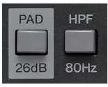
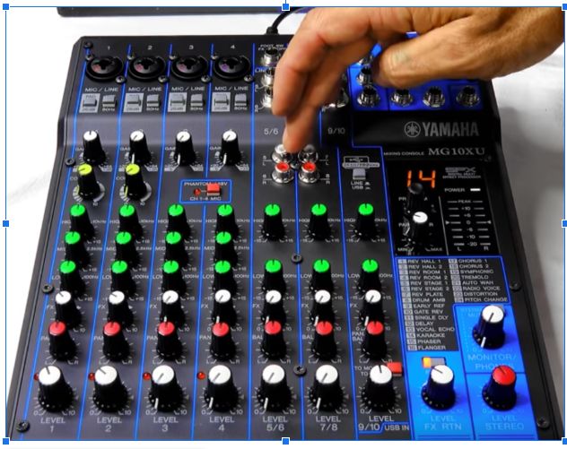

# yamaha-mixer notes
Yamaha MG10XU 10-channel Mixer with USB and FX

**Yamaha mg06x notes:**
- http://www.karaoke-systems.com/yamaha-mg06x-6-input-compact-stereo-mixer-with-effects-review.html
- http://www.karaoke-systems.com/yamaha-mg10xu-10-input-stereo-mixer-with-effects-review.html
- https://ask.audio/articles/review-yamaha-mg10xu-the-mg-series-gets-more-goodies
- And if you don’t own a DAW program, just download Cubase AI for free


**Singtrix presets**
- https://cdn.shopify.com/s/files/1/0270/7573/t/1/assets/SingTrix_Presets_MegaPack.pdf

**Budget Hom eStudion**
- https://www.youtube.com/watch?v=XLXSqan3Jcs&feature=youtu.be

## Yamaha MG 10 setup
- How to use yamaha mixer, https://www.youtube.com/watch?v=bybWokSUnBg

- PAD and HPF Switches under microphone
The four mono input channels have PAD and HPF switches. Turning the PAD switch on will attenuate the sound input to the unit. This is typically not needed when a microphone is used for vocals. The HPF (High Pass Filter) switch will apply a high-pass filter that attenuates frequencies below 80Hz. This can be useful when speaking into the microphone to help reduce wind sound and vibration.
HPF - useful when speaking into the microphone to help reduce wind sound and vibration.


```text
Gain - main gain,  start at 12 o’clock
Comp - compression, start at 0 - will cut down from singers screaming
High, Mid, Low  -at 12 o’clock

FX - at 0 or upto 3
Pan - at 12 o’clock
Peak -  less than 12 o’clock

Music input
High, Mid, Low  -at 12 o’clock
FX - at 0 
Pan - at 12 o’clock
Peak -  less than 12 o’clock, depending on how  much loud music you want

Program - select 14 for karaoke
Press FX Rtn
```
